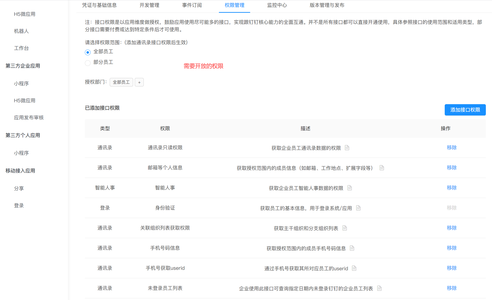

### 初学Django时碰到的一个需求，因为公司中很多员工在修改密码之后，有一些关联的客户端或网页中的旧密码没有更新，导致密码在尝试多次之后账号被锁，为了减少这种让人头疼的重置解锁密码的操蛋工作，自己做了一个自助修改小平台。  
### 水平有限，代码写得不好，但是能用，有需要的可以直接拿去用。
#### 场景说明：
因为本公司AD是早期已经在用，用户的个人信息不是十分全面，例如:用户手机号。  
钉钉是后来才开始使用，钉钉默认是使用手机号登录。
用户自行重置密码时如果通过手机号来进行钉钉与AD之间的验证就行不通了。 
 
### 新版本逻辑：
>用户扫码通过之后，通过临时授权码，提取用户的unionid，再通过unionid判断用户在本企业中是否存在。如果存在，提取用户钉钉账号的邮箱，通过邮箱转成账号，将账号拿到AD中进行比对来验证账号在AD中是否存在并账号状态是激活的。满足以上条件的账号就会视为可自行重置密码。

### 代码提交到--新分支：
```
djaong3
```

### 提示：
```
AD必须使用SSL才能修改密码（这里被坑了N久...）
自行部署下AD的证书服务，并颁发CA证书，重启服务器生效。
具体教程百度一下，有很多。
```

### 本次升级、修复，请使用最新版：
+ 升级Python版本为3.8
+ 升级Django到3.2
+ 修复用户名中使用\被转义的问题
+ 重写了dingding模块，因为dingding开发者平台接口鉴权的一些变动，之前的一些接口不能再使用，本次重写。
+ 重写了ad模块，修改账号的一些判断逻辑。
+ 重写了用户账号的格式兼容，现在用户账号可以兼容：username、DOMAIN\username、username@abc.com这三种格式。
+ 优化了整体的代码逻辑，去掉一些冗余重复的代码。

## 线上环境需要的基础环境：
+ Python 3.8.9 (可自行下载源码包放到项目目录下，使用一键安装)
+ Nginx
+ Uwsgi

## 截图


## 钉钉必要条件：
#### 创建企业内部应用
* 在钉钉工作台中通过“自建应用”创建应用，选择“企业内部开发”，创建H5微应用或小程序，在应用首页中获取应用的：AgentId、AppKey、AppSecret。
* 应用需要权限：身份验证、消息通知、通讯录只读权限、手机号码信息、邮箱等个人信息、智能人事，范围是全部员工或自行选择
* 应用安全域名和IP一定要配置，否则无法返回接口数据。

参考截图配置：




#### 移动接入应用--登录权限：
>登录中开启扫码登录，配置回调域名：“https://pwd.abc.com/callbackCheck”
  其中pwd.abc.com请按自己实际域名来，并记录相关的：appId、appSecret。

参考截图配置：


### 使用脚本自动快速部署，只适合Centos，其它发行版本的Linux请自行修改相关命令。
#### 我添加了一个快速自动部署脚本，可快速自动部署完成当前项目上线。
把整个项目目录上传到新的服务器上
```shell
chmod +x auto-install.sh
./auto-install.sh
```
等待所有安装完成

#### 脚本安装完成之后，按自己实际的配置修改项目配置文件：
修改pwdselfservice/local_settings.py中的参数，按自己的实际参数修改
```` python
修改pwdselfservice/local_settings.py中的参数，按自己的实际参数修改
```` python
# AD配置
# AD主机，可以是IP或主机域名，例如可以是:abc.com或172.16.122.1
AD_HOST = '修改为自己的'

# 用于登录AD做用户信息验证的账号， 需要有修改用户账号密码的权限。
# 账号格式使用DOMAIN\USERNAME，例如：abc\pwdadmin
AD_LOGIN_USER = '修改为自己的'

# 密码
AD_LOGIN_USER_PWD = '修改为自己的'

# BASE DN，账号的查找DN路径，例如：'DC=abc,DC=com'，可以指定到OU之下，例如：'OU=RD,DC=abc,DC=com'。
BASE_DN = '修改为自己的'

# 钉钉配置
# 钉钉接口地址，不可修改
DING_URL = "https://oapi.dingtalk.com/sns"

# 钉钉企业ID
DING_CORP_ID = '修改为自己的'

# 钉钉E应用
DING_AGENT_ID = '修改为自己的'
DING_APP_KEY = '修改为自己的'
DING_APP_SECRET = '修改为自己的'

# 钉钉移动应用接入
DING_SELF_APP_ID = '修改为自己的'
DING_SELF_APP_SECRET = '修改为自己的'

# Crypty key 通过generate_key生成，可不用修改
CRYPTO_KEY = b'dp8U9y7NAhCD3MoNwPzPBhBtTZ1uI_WWSdpNs6wUDgs='

# COOKIE 超时单位是秒，可不用修改
TMPID_COOKIE_AGE = 300

# 主页域名，index.html中的钉钉跳转等需要指定域名，如果是脚本自动部署，以下域名会自动替换。
HOME_URL = 'PWD_SELF_SERVICE_DOMAIN'
````
### 以上配置修改完成之后，则可以通过配置的域名直接访问。  

    
    
    
# 手动部署 

## 按自己实际的配置修改项目配置参数：
修改pwdselfservice/local_settings.py中的参数，按自己的实际参数修改

```` python
# ########## AD配置，修改为自己的
# AD主机，可以是IP或主机域名，例如可以是: abc.com或172.16.122.1
AD_HOST = r'修改成自己的'

# AD域控的DOMAIN名，例如：abc、abc.com
AD_DOMAIN = r'修改成自己的'

# 用于登录AD做用户信息处理的账号，需要有修改用户账号密码或信息的权限。
# AD账号，例如：pwdadmin
AD_LOGIN_USER = r'修改成自己的'
# 密码
AD_LOGIN_USER_PWD = r'修改为自己的'

# BASE DN，账号的查找DN路径，例如：'DC=abc,DC=com'，可以指定到OU之下，例如：'OU=RD,DC=abc,DC=com'。
BASE_DN = r'修改成自己的'

# 是否启用SSL,
# 注意：AD必须使用SSL才能修改密码（这里被坑了N久...）,自行部署下AD的证书服务，并颁发CA证书，重启服务器生效。具体教程百度一下，有很多。
AD_USE_SSL = True
# 连接的端口，如果启用SSL默认是636，否则就是389
AD_CONN_PORT = 636


# ########## 钉钉
# 钉钉配置
# 钉钉接口主地址，不可修改
DING_URL = r'https://oapi.dingtalk.com'

# 钉钉企业ID <CorpId>，修改为自己的
DING_CORP_ID = '修改为自己的'

# 钉钉企业内部开发，内部H5微应用或小程序，用于读取企业内部用户信息
DING_AGENT_ID = r'修改为自己的'
DING_APP_KEY = r'修改为自己的'
DING_APP_SECRET = r'修改为自己的'

# 移动应用接入 主要为了实现通过扫码拿到用户的unioid
DING_MO_APP_ID = r'修改为自己的'
DING_MO_APP_SECRET = r'修改为自己的'

# 执行：python3 ./resetpwd/utils/crypto.py 生成
# 可自行生成后替换
CRYPTO_KEY = b'dp8U9y7NAhCD3MoNwPzPBhBtTZ1uI_WWSdpNs6wUDgs='

# COOKIE 超时单位是秒，可不用修改
TMPID_COOKIE_AGE = 300

# 主页域名，钉钉跳转等需要指定域名，格式：pwd.abc.com。
HOME_URL = 'PWD_SELF_SERVICE_DOMAIN'
````

# 手动部署
#### 自行安装完python3之后，使用python3目录下的pip3进行安装依赖：
#### 我自行安装的Python路径为/usr/local/python3

项目目录下的requestment文件里记录了所依赖的相关python模块，安装方法：
* /usr/local/python3/bin/pip3 install -r requestment
等待所有模块安装完成之后进行下一步。

安装完依赖后，直接执行
/usr/local/python3/bin/python3 manager.py runserver x.x.x.x:8000
即可临时访问项目，线上不适用这种方法，线上环境请使用uwsgi。


## 修改uwsig.ini配置:
IP和路径按自己实际路径修改
````ini
[uwsgi]
http-socket = PWD_SELF_SERVICE_IP:PWD_SELF_SERVICE_PORT

chdir = PWD_SELF_SERVICE_HOME
 
module = pwdselfservice.wsgi:application

master = true
 
processes = 4
 
threads = 4
 
max-requests = 2000
 
chmod-socket = 755
 
vacuum = true

#设置缓冲
post-buffering = 4096

#设置静态文件
static-map = /static=PWD_SELF_SERVICE_HOME/static

#设置日志目录
daemonize = PWD_SELF_SERVICE_HOME/log/uwsgi.log
````

## 通过uwsgiserver启动：
其中PWD_SELF_SERVICE_HOME是你自己的服务器当前项目的目录，请自行修改
将以下脚本修改完之后，复制到/etc/init.d/，给予执行权限。
uwsgiserver:
```shell
#!/bin/sh

INI="PWD_SELF_SERVICE_HOME/uwsgi.ini"
UWSGI="/usr/share/python-3.6.9/bin/uwsgi"
PSID=`ps aux | grep "uwsgi"| grep -v "grep" | wc -l`

if [ ! -n "$1" ]
then
    content="Usages: sh uwsgiserver [start|stop|restart]"
    echo -e "\033[31m $content \033[0m"
    exit 0
fi

if [ $1 = start ]
then
    if [ `eval $PSID` -gt 4 ]
    then
        content="uwsgi is running!"
        echo -e "\033[32m $content \033[0m"
        exit 0
    else
        $UWSGI $INI
        content="Start uwsgi service [OK]"
        echo -e "\033[32m $content \033[0m"
    fi

elif [ $1 = stop ];then
    if [ `eval $PSID` -gt 4 ];then
        killall -9 uwsgi
    fi
    content="Stop uwsgi service [OK]"
    echo -e "\033[32m $content \033[0m"
elif [ $1 = restart ];then
    if [ `eval $PSID` -gt 4 ];then
        killall -9 uwsgi
    fi
    $UWSGI --ini $INI
    content="Restart uwsgi service [OK]"
    echo -e "\033[32m $content \033[0m"

else
    content="Usages: sh uwsgiserver [start|stop|restart]"
    echo -e "\033[31m $content \033[0m"
fi

````
脚本内的路径按自己实际情况修改

## 自行部署Nginx，然后添加Nginx配置
#### Nginx配置：
Nginx Server配置：
* proxy_pass的IP地址改成自己的服务器IP
* 配置可自己写一个vhost或直接加在nginx.conf中
```` nginx
server {
    listen  80;
    server_name pwd.abc.com;

    location / {
        proxy_pass         http://192.168.x.x:8000;
        proxy_set_header   Host              $host;
        proxy_set_header   X-Real-IP         $remote_addr;
        proxy_set_header   X-Forwarded-For   $proxy_add_x_forwarded_for;
        proxy_set_header   X-Forwarded-Proto $scheme;
    }
	access_log  off;
}
````
- 执行Nginx reload操作，重新加载配置